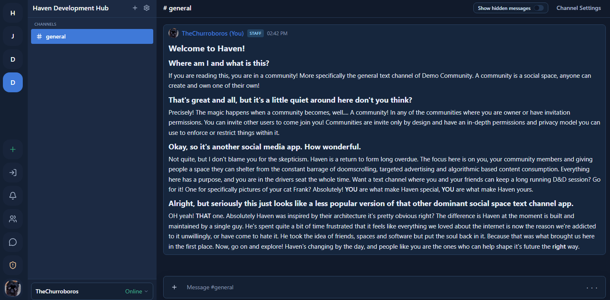

# Haven
**Community chat for people who give a damn.**

Haven is a real-time community chat platform across Electron desktop, web, and iOS. It exists because community chat stopped feeling like it was built for communities — and proving that it could be done differently was worth the effort.



---

## What it is

Haven gives streamers and their communities a space that works the way they'd expect — without the algorithmic feeds, ad targeting, or identity verification schemes that have crept into the platforms people used to love.

- Invite-only community spaces with server-scoped roles and permissions
- Real-time text channels with full markdown composition and rendering
- Voice channels via WebRTC
- Direct messages, friends, notifications, and push notifications
- Media upload and community management tools
- A moderation system enforced at the database level, not the client
- A permission model that's readable, versioned, and verifiable

## Platforms

**Electron desktop** is the primary production target. **Web** runs as a Vite client. **iOS** is in active TestFlight distribution.

The iOS client runs on a custom OTA update pipeline built on top of Expo Updates — asset hashing, bundle generation, and manifest serving are handled by a local toolchain that publishes to a Supabase-backed Edge Function. This replaces EAS Update entirely and keeps the update infrastructure under the same roof as the rest of the backend. Everything outside of voice works on mobile: DMs, reports, modmail, push notifications, community creation, invites, friends, media upload, and full rich text composition and rendering via [`react-native-enriched-markdown`](https://github.com/software-mansion-labs/react-native-enriched-markdown).

---

## Why it's built this way

### Security lives in the database, not the UI

Most chat platforms treat access control as a presentation problem — hide things from users who shouldn't see them. Haven treats it as a data problem. Every permission check is a Postgres RLS policy or a security-definer RPC. The client reflects what the database says. It does not decide.

This matters because a client can lie. A user can bypass UI guards with devtools. A Postgres row-level security policy enforced at the query level cannot be bypassed from the client regardless of what the frontend does. Moderation visibility, ban enforcement, channel access — all of it bottoms out at the database.

### The anon key being public is intentional

Haven uses Supabase's publishable anon key on the client. This is the correct approach, not a shortcut. The anon key cannot do anything the RLS policies do not permit. The service role key never ships in the renderer. Voice relay credentials live in Edge Function secrets and are only returned after the function validates the requesting user's JWT and confirms channel membership before responding.

### The source is public for the same reason

The schema, RLS policies, migration history, and voice relay function are all readable in this repo. If the security model works, it should hold up to inspection. If it doesn't, hiding it wouldn't make it safer.

### The monorepo is structured around a stable shared core

Business logic, types, and hooks live in `packages/shared` and are platform-agnostic. Platform-specific behavior is isolated to each app target through a registration pattern rather than leaking into shared code. The Electron client, the web client, and the iOS client all run against the same tested core.

---

## Stack

| Layer | Technology |
|---|---|
| Desktop | Electron Forge + Webpack |
| Web | Vite + React |
| iOS | React Native + Expo (dev client, TestFlight) |
| Language | TypeScript |
| UI | Tailwind CSS + shadcn/ui (desktop/web), NativeWind (iOS) |
| Backend | Supabase (Auth, Postgres, Realtime, Edge Functions) |
| OTA Updates (iOS) | Custom Expo Updates-compatible pipeline via Supabase Edge Function |
| Voice | WebRTC + Xirsys TURN relay |
| State | Zustand with precise per-selector isolation |
| Monorepo | `packages/shared` across all platforms |

---

## Architecture

Haven is a monorepo with three app targets:

- `apps/electron` — primary production target
- `apps/web` — Vite web client
- `apps/mobile` — React Native + Expo, actively distributed via TestFlight
- `packages/shared` — types, hooks, and business logic shared across all platforms

State is managed with Zustand. Stores use precise selectors to isolate renders — components subscribe only to the slice of state they need, which produces real and measurable render isolation rather than theoretical benefits. The chat interface went through a full Zustand refactor to remove prop drilling and the performance difference in production was noticeable.

The Electron client uses a custom title bar with IPC-wired window controls and a CI/CD pipeline with branch protection, conventional commits, and a GitHub Actions publish flow gated on human approval. Auto-updates are handled by Electron Forge's update mechanism against GitHub Releases, with a version attestation table in Supabase as a secondary verification layer — requiring an attacker to compromise both GitHub and Supabase simultaneously to serve a malicious update.

The iOS OTA pipeline is a custom implementation of the Expo Updates protocol. A local toolchain handles asset fingerprinting, bundle generation, and manifest construction. The manifest is served by a Supabase Edge Function and the client fetches and applies updates at launch without going through EAS. This gives full control over the update cadence and keeps update infrastructure consolidated with the rest of the backend.

---

## Verifying the security model

1. Client auth and data access — `packages/shared/src/lib/supabase.ts`
2. RLS policies and schema — `services/supabase/migrations/`
3. Voice secret handling — `services/supabase/functions/voice-ice/index.ts`

Run the app against your own Supabase project and inspect network calls in devtools. Nothing load-bearing is hidden.

---

## Testing

Haven includes a local Supabase-backed regression harness covering SQL, RLS policies, and backend seam contracts.

```bash
npm run test:db        # SQL + RLS regression suite via psql against local Supabase
npm run test:backend   # Backend seam contract and integration tests
npm run test:unit      # Renderer and component tests
npm run test:report    # Human-readable proof report with full logs
```

---

## Status

Haven is in active production use across desktop, web, and iOS. Current focus is voice on mobile and continued hardening across all three platforms.

---

## License

Haven is source-available under the [Business Source License 1.1](./LICENSE.md). The source is inspectable but commercial use, competing platforms, and hosted clones require a separate license.

Change Date: 2030-01-01 · Change License: MIT · Inquiries: legal@redrixx.com