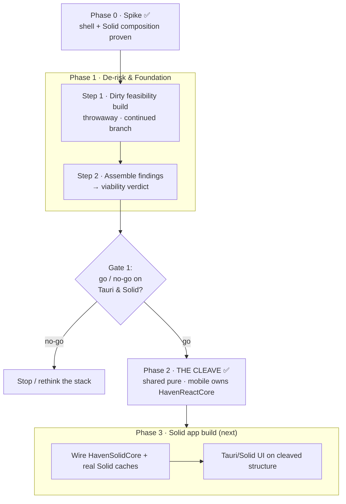

# Tauri + Solid — Spike → Release Roadmap

Project-management plan for migrating the desktop stack (Electron → Tauri, React →
Solid) from the proven spike all the way to release — **deliberately not** rushing
to a compiling app. Companion to [`tauri-solid-rebuild.md`](./tauri-solid-rebuild.md)
(the *why/what* + dependency mapping); this doc is the *how/when* + decision gates.

## How this doc is built
Built iteratively: propose the next logical step → pressure-test it → record it here
with a Mermaid update. Each step uses the same shape so the roadmap stays scannable:

> **Step** · Goal · Deliverable(s) · Risks/unknowns · **Exit criteria (the gate)**

The **exit criteria** are the point — "how do we *know* this is done and we're allowed
to move on" — so the plan resists scope drift. Phases are buckets; steps fill them as
the loop progresses. `TBD` = not yet defined.

## Visual roadmap



---

## Phase 0 — Spike ✅ (done)
Shell + Solid composition proven. `apps/tauri` (Rust shell + `invoke` ping) and
`packages/solid-client` (placeholder UI) are merged to `staging` and run via
`npm run tauri:dev`. No `@shared` wiring yet — purely "does the shell host Solid."

---

## Phase 1 — De-risk & Foundation

### Step 1 — Dirty feasibility build (throwaway)
**Status:** planned · not started

**Branch / disposability:** lives **only** on `feat/tauri-solid-continued`, **never
merges**, deleted on exit. The code is garbage by design — only the *findings*
survive. This framing is intentional: pre-deciding it's disposable removes the
sunk-cost pressure to "save what we wrote," which is what caused prior refactor pain.

**Goal:** answer the load-bearing "will it even work" questions *before* committing
to any architecture. Hack freely — crappy auth, minimal UI, direct backend calls.

**Probes (these questions ARE the gate):**

| # | Probe | What it proves | Result | Notes |
|---|---|---|---|---|
| 1 | **Injection** | Shell can inject *real* capabilities into Solid (beyond `ping`) | — | |
| 2 | **`@shared` from Solid** | Solid can drive the framework-agnostic shared logic (stores/nexus), incl. a strategy for the ~7 React-bound files — *the load-bearing assumption of the whole migration* | ✅ | Solid reactively drives the **real** `authStore` via a `subscribe → signal` wrapper (`fromStore`) — `isLoading`/`user` confirmed reactive in-browser. **Finding:** store uses `zustand` `create` (React-bound, pulls React); migrate shared stores to `zustand/vanilla createStore` for a React-free layer. |
| 3 | **Supabase in WKWebView** | Hacked login, session persistence, and **Realtime websockets** alive in the native webview (not Chromium) | ✅* | `signInWithPassword` ✅ + `functions.invoke("voice-token")` ✅ in WKWebView (via the voice run). *Supabase **Realtime channels** not yet directly exercised — but auth + functions + LiveKit `wss://` all work, so transport viability is strongly indicated. |
| 4 | **Essential Solid libs** | Kobalte (dialog/menu), a virtualized list (chat), markdown, and the editor core render + function | — | |
| 5 | **OS bridge** | One real Tauri command beyond `ping` round-trips (secure storage / notification / fs) | 🔄 | Native mic permission (Info.plist + audio-input entitlement) ✅ + `ping` invoke ✅ (spike). A richer native command (fs / notification / secure-storage) still to test. |
| 6 | **Voice** | Minimal LiveKit: join a room + hear audio in WKWebView. *Highest-risk item — a ❌ here halts the Tauri bet* | ✅ | **Full chain cleared.** Mic capture → Supabase sign-in → `voice-token` → LiveKit connect (WebRTC in WKWebView) → publish + subscribe → **two-way audio confirmed cross-device** (Tauri ↔ desktop). |

Result legend: ✅ works · ⚠️ works with caveats · ❌ blocker.

**Deliverable:** a findings writeup (the table above, filled) + an explicit **go/no-go
recommendation on (a) the Tauri shell and (b) the Solid UI**.

**Risks / unknowns:**
- WKWebView ≠ Chromium — WebRTC (voice), websockets (realtime), and media permissions are where native webviews bite.
- The Solid ↔ `@shared` reactivity bridge (wrapping vanilla stores into signals).
- Solid library maturity (Kobalte / virtua / cmdk-solid).

**Exit criteria (gate):** all 6 probes answered (✅/⚠️/❌ with notes). Feeds Step 2.
Once findings are captured → **nuke the dirty build.**

**Execution order (refined):** **hardline the calls** — no `@shared` reactivity in the
voice track (that stays a separate probe), for diagnostic purity. Voice is a dependency
chain; run cheapest-gate-first:
1. WKWebView `getUserMedia({audio})` + native mic config (Info.plist usage string +
   audio-input entitlement). ← **gate**; if the webview can't capture mic, voice is dead.
2. Authed Supabase client → `voice-token` invoke (`{ communityId, channelId }`) for a real room.
3. `livekit-client` connect → publish mic → subscribe audio → join the same channel from desktop.

Probe 2 (`@shared` from Solid) is an independent track. Real community/channel ids + a
test account are hardcoded in the junk build for the cross-device test.

### Step 2 — Assemble findings & viability verdict (Gate 1)
**Status:** planned

**Goal:** turn the 6 probe results into a reliable go/no-go prediction for the *full*
build. This is the formal **Gate 1** — the decision on whether the stack is worth
committing to. We do this *immediately* after Step 1; no continuation is planned
before it, because planning a build that might be DOA is wasted effort.

**Deliverable:** the filled findings table + a written verdict:
- **GO** — stack is viable → re-enter the roadmap loop and plan the real build.
- **NO-GO** — a probe is a hard blocker → stop, rethink the stack.
- **CONDITIONAL** — viable, but with named blockers to resolve before committing.

**Exit criteria (gate):** a recorded decision — GO / NO-GO / CONDITIONAL.

#### 🟢 Verdict (recorded 2026-06-07): **GO**
Both killswitches cleared:
- **Voice (Probe 6)** — two-way audio cross-device through WKWebView (mic → `voice-token`
  → LiveKit WebRTC → publish/subscribe). The single most likely ❌ in the whole bet; passed.
- **`@shared` from Solid (Probe 2)** — Solid reactively drives the real `authStore` via a
  `subscribe → signal` wrapper.

Incidental: Supabase auth + `functions.invoke` in the webview (Probe 3) ✅; native mic
permission (Probe 5) ✅.

Non-gating follow-ups carried into the foundation phase (low-risk, not blockers):
- **Probe 1** — a non-trivial *injected* OS capability (spike proved the `ping` mechanism;
  a real fs/secure-storage injection still TBD; overlaps Probe 5).
- **Probe 4** — validate the Solid lib set (Kobalte / virtua / markdown / editor) per-component.
- Architecture note — migrate `@shared` stores from `zustand` `create` (React-bound) to
  `zustand/vanilla createStore` for a genuinely React-free shared layer. **Resolved by true
  cleave:** session stores relocated to mobile; shared retains only vanilla policy state.
- **Voice real-build note** — echo-cancellation tuning (the feedback was two co-located
  devices, not a defect).

→ Re-enter the roadmap loop to plan the real build (Phases 2–4). **Then nuke the dirty build.**

---

## Phase 2 — THE CLEAVE ✅ (split shared logic from per-platform caches)

> **Canonical detail lives in [`solid-migration-handoff.md`](./solid-migration-handoff.md)
> — read its §0 ruleset first.** This section is the phase + decision record.

**Status:** ✅ complete (2026-06-08 true cleave on `feat/shared-core-hardening`).
Supersedes the prior "shared-core hardening / Approach C" plan (preserved below under *Superseded*).

**The decision, in one line:** stop trying to share a *reactive cache* across React and Solid.
Split the data layer into **three layers** — pure shared logic; a per-platform cache (mobile
React / desktop+web Solid); per-platform UI — and never share the cache.

**Why we changed course (the realization):**
- The Nexus pattern was lifted from the stoat/Revolt SDK, which runs it on **Solid's**
  fine-grained reactivity. That's *why* the original has no snapshot caches / `revision`
  counters / selector factories.
- Haven ran the same pattern on **zustand** (coarse, manual reactivity) and **shared the
  reactive cache across platforms** → all that machinery had to be hand-built, and the
  shared reactive core grew illegible. The complexity is *substrate scar tissue*, not the
  pattern's fault.
- The rebuild targets **Solid** — the substrate the pattern was born for. So: share the
  *logic* (pure functions, identical everywhere), let each platform own its *cache* in its
  native idiom. Mobile keeps React's surgical re-renders untouched (precision lives in how the
  screen reads, not in the shared machinery); desktop/web get a clean Solid-native cache.

**Shape of the cleave (handoff §3):**
```
packages/shared   = PURE logic + types + backend.  zero framework, zero reactivity.
apps/mobile/data  = React cache (today's Nexus, relocated + thinned), calls shared logic.
<solid>/data      = Solid-native cache, built fresh, calls shared logic.
```

**Per-domain loop (handoff §4, CI-gated):** inventory → extract shared logic → relocate mobile
cache → build Solid stub → gate (`test:cleave`) → next domain. **All domains done for mobile.**

**Disposition of the Approach-C work (handoff §5):** pure projections and logic functions are
**Layer-1 keepers**. Reactive nexuses are **mobile's** cache. Adapter packages **retired**.

**Exit (Phase 2 / The Cleave):** ✅ met — `packages/shared` provably pure
(`check:shared-portable` with empty exclusions) · reactive cache + `HavenReactCore`
owned by mobile · standalone selector-hooks · no reactive store shared across frameworks
· mobile green (`test:cleave`) · web/electron breakage accepted · Solid app build is
**Phase 3+** (future `HavenSolidCore`, not started).

**Out of scope (next phase, NOT now):** building screens/features/the Solid app UI. See handoff §7.

---

<details>
<summary><strong>SUPERSEDED — Approach C: framework-agnostic shared reactive core (kept for history)</strong></summary>

> This was the plan executed in the first 5 commits on `feat/shared-core-hardening`
> (binding packages + Channel/Community/DM/Notification conversions). It tried to make **one
> reactive cache framework-neutral and shared** via `react-bindings` + `solid-bindings`. That
> sharing of the *cache* (not the logic) is exactly what The Cleave undoes. Its pure-logic
> extraction survives (§5 of the handoff); its dual-binding/shared-store half is retired.

- **Depth:** full extraction → shared core *zero-React*, per-domain CI-gated loop.
- **Adapter topology:** `packages/react-bindings` (React) + `packages/solid-bindings` (Solid) over a
  shared `zustand/vanilla` core; "the Solid build never imports react-bindings" as the zero-React proof.
- **Per-domain loop:** vanilla store → relocate hooks to react-bindings → add solid-bindings → migrate
  call sites → `test:ci` + `mobile:typecheck` green.
- **3a audit** (kept as the catalog of what's in `shared`): `lib/backend/` entirely React-free;
  decoupling concentrated in `nexus/`. **3b.2 discovery:** entity family is a per-class loop (base
  `use<S>` used by `CommunityMessageNexus`; 4 subclasses override `store`).
- **Service-class rename** `…Nexus` → `…ControllerNexus`, base `ControllerNexus.ts` extracted from
  repetition — *not pursued*; folded into the cleave's reasoning instead.
- **3c cleanups / 3d decomposition** (`communityDataBackend.ts` @ 2525 split) — still valid hygiene,
  still their own gated steps, now framed as work on the *pure shared logic* layer.
</details>

---

## 🚨 STANDING DECISION — Monorepo package resolution: alias → workspace packages

**Status: DECIDED (end state) · NOT YET SCHEDULED · interim guardrail in place.**

> **Reframed for The Cleave:** the package that matters now is **`packages/shared` (the pure logic
> layer)** — it must resolve cleanly from *both* mobile and the Solid world. `solid-bindings` is being
> retired; `react-bindings` becomes mobile-local. So read "the binding packages and `@shared`" below as
> primarily **`@shared`**: the pure shared layer that both platforms' caches import.

> **`@shared` (and any lasting shared package) MUST eventually become a real workspace package
> (`package.json` + `name` + `exports`). The current path-alias approach is a deliberate INTERIM,
> not the destination.**

**Why this is the end state (the alias's truthful cost):**
- No enforced public surface — anything can deep-import internals; no `exports` map.
- No real dependency graph — alias "folders" can't declare their own deps; they inherit the app's.
- Unbounded, hand-maintained resolution machinery duplicated across **every toolchain**: tsconfig `paths`
  + babel `module-resolver` + Metro `resolveRequest` + Vite + Vitest. Cost scales with
  (packages × toolchains) and is paid continuously and silently. Each is a drift footgun (a change that
  updates 2 of N configs passes typecheck and only fails at app boot / bundle).
- Opts out of ecosystem tooling (turbo/nx graphs, `npm ls`, audits, per-package caching).

**Honest cost of the migration (why it's a milestone, not a drive-by):**
- Metro + symlinked workspaces is *the* historically painful part — it's literally why this repo
  hand-rolled `resolveRequest`. SDK 55 Metro handles symlinks far better, but hoisting / duplicate-React
  hazards still need care.
- Build-vs-source decision: ship TS source via `exports` (every tool must transpile it) **or** add a
  per-package build step.
- `@shared` has many consumers → converting it touches every app's resolution at once (high blast radius).

**Sequencing rules (do NOT violate):**
1. **Do not half-migrate.** Converting only the binding packages while `@shared` stays aliased = two
   resolution mechanisms = worse than either pure state. **Convert the binding packages AND `@shared`
   together**, as one dedicated "monorepo resolution" milestone.
2. **Trigger:** schedule the milestone when `@shared`-as-a-real-package is on the near roadmap.
3. **Prerequisite/safety net:** the headless **`mobile:bundle`** gate (`expo export`, added with the
   ChannelNexus loop) is what makes this conversion *safe to attempt* — it fails on any broken Metro/Babel
   resolution in CI without a simulator. Land/keep that gate green before attempting the conversion.

**Interim that IS sanctioned until then:** a single alias **manifest** (one source of truth consumed by
babel + metro) + a `check:aliases` guard that fails CI on tsconfig drift. This is acceptable **only** as
the bridge to the milestone above — it is explicitly throwaway and gets deleted by the conversion. Do not
let the interim ossify into "the way we do it."

> **🔍 Finding (ChannelNexus loop, recorded 2026-06-08): mobile alias resolution is driven by `tsconfig`
> paths, not babel/metro.** Empirically (via the `mobile:bundle` self-test): breaking the `@react-bindings`
> alias in **both** `babel.config.js` (module-resolver) **and** `metro.config.js` (`resolveRequest`) still
> bundled successfully — only when the **`tsconfig.json` `paths`** entry was *also* removed did
> `expo export` fail. Expo Metro (SDK 49+) honors `compilerOptions.paths` natively. **Implication:** the
> babel + metro alias entries for the binding packages are **redundant belt-and-suspenders** (kept only to
> match the existing `@shared`/`@platform` convention). The cleaner interim may be to **rely on `tsconfig`
> paths as the single mobile resolver and delete the babel/metro alias copies** — fewer layers to drift,
> and directionally toward toolchain-native resolution (the workspace end-state). Open question to settle
> with the milestone: tsconfig-paths-only vs. manifest-synced-belt-and-suspenders. (Verify tsconfig-paths
> covers Jest + any babel transform edge cases before deleting layers.)
>
> **Corollary — what `mobile:bundle` does and doesn't gate:** it's a valid headless CI smoke (exits **1**
> on a *total* resolution failure: missing module, broken import, transform error, or an alias broken in
> **all** layers). Because the resolvers are redundant, it does **NOT** catch single-layer alias *drift* —
> that still needs the explicit `check:aliases` guard (or layer reduction above).

---

## Keep-in-mind / architecture notes (foundation inputs)
Captured from probe findings + a `Nexus` review. Shape Phase 2; not yet sequenced.

### Governing principle: framework-agnostic core + thin per-platform adapters
The shared layer serves **three** consumers — React Native (mobile), React (Electron/web
today), and Solid (Tauri). So reactivity must **not** live in the shared core:
- **Core** = `zustand/vanilla` (`createStore`) — CRUD, persist, transform, `subscribe`.
  Pure, no React import.
- **Adapters** (thin, per-platform): React adapter (`useStore` hooks) for RN/Electron;
  Solid adapter (`subscribe → signal`) for Tauri.

Applies to **both** the plain stores (`authStore`, …) and the `Nexus` entity layer.

### `Nexus<T,R>` — verified state (not hearsay)
- `packages/shared/src/nexus/Nexus.ts` is **React-bound**: imports `create`/`useStore`/
  `UseBoundStore` from `zustand`; `_store` is a `UseBoundStore`.
- The reactive methods `use<S>` / `useAll` / `useOne` (~lines 132–153) **appear to be dead
  code — zero call sites found** across shared/web-client/mobile/electron. Vestigial, not a
  load-bearing API.
- **~5** domain subclasses extend it (DirectMessage, CommunityMessage, Community, Channel,
  Notification). They rely on the **CRUD / persist / transform** layer — fully cross-platform,
  unaffected by the change.

### The refactor (smaller/safer than it first looks)
1. Swap the base `_store`: `create` (zustand) → `createStore` (`zustand/vanilla`). Removes
   React from the shared Nexus layer.
2. Drop the three unused `use*` reactive methods (dead code) — or relocate to a React adapter
   if/when a platform actually needs reactive Nexus subscription.
3. Add per-platform reactive adapters **only as needed** — currently nothing consumes the
   reactive trio, so it's greenfield (no call-site migration).
4. The ~5 subclasses + CRUD/persist/transform stay intact.

### Solid-ism to design around
Solid tracks reactivity at access time, so a Solid adapter (`createNexusOne(nexus, id)`) must
take **`id` as a getter `() => string`**, not a plain string, so it re-subscribes when the id
changes. Same for any adapter taking reactive args.

### Caveat
The base swap is small *because* the reactive methods are unused. The real per-platform
reactive work surfaces whenever a platform first needs to reactively consume a Nexus — design
the adapter signatures (getter-based) before that point.
