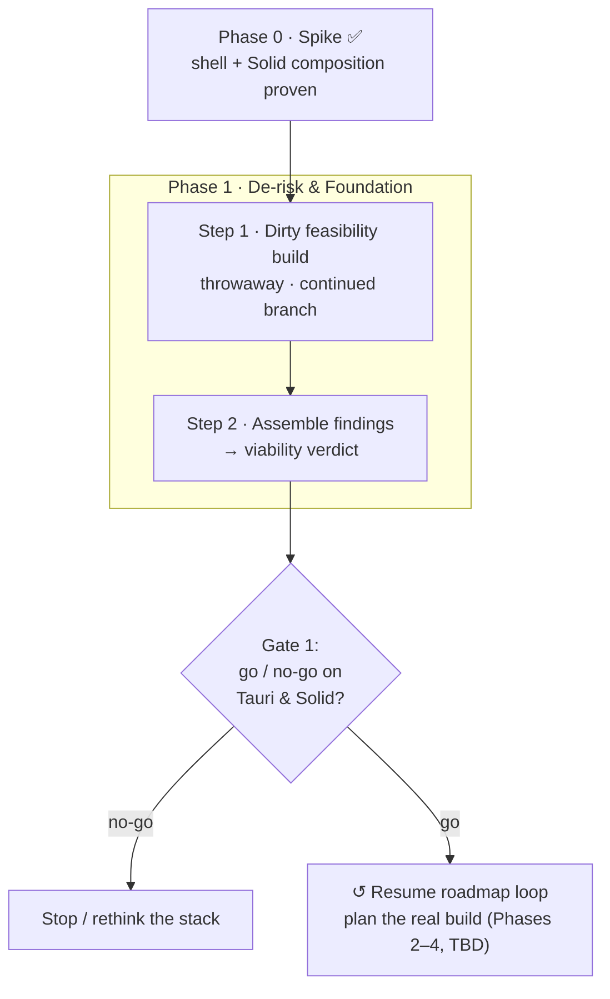

# Tauri + Solid — Spike → Release Roadmap

Project-management plan for migrating the desktop stack (Electron → Tauri, React →
Solid) from the proven spike all the way to release — **deliberately not** rushing
to a compiling app. Companion to [`tauri-solid-rebuild.md`](./tauri-solid-rebuild.md)
(the *why/what* + dependency mapping); this doc is the *how/when* + decision gates.

## How this doc is built
Built iteratively: propose the next logical step → pressure-test it → record it here
with a Mermaid update. Each step uses the same shape so the roadmap stays scannable:

> **Step** · Goal · Deliverable(s) · Risks/unknowns · **Exit criteria (the gate)**

The **exit criteria** are the point — "how do we *know* this is done and we're allowed
to move on" — so the plan resists scope drift. Phases are buckets; steps fill them as
the loop progresses. `TBD` = not yet defined.

## Visual roadmap

---

## Phase 0 — Spike ✅ (done)
Shell + Solid composition proven. `apps/tauri` (Rust shell + `invoke` ping) and
`packages/solid-client` (placeholder UI) are merged to `staging` and run via
`npm run tauri:dev`. No `@shared` wiring yet — purely "does the shell host Solid."

---

## Phase 1 — De-risk & Foundation

### Step 1 — Dirty feasibility build (throwaway)
**Status:** planned · not started

**Branch / disposability:** lives **only** on `feat/tauri-solid-continued`, **never
merges**, deleted on exit. The code is garbage by design — only the *findings*
survive. This framing is intentional: pre-deciding it's disposable removes the
sunk-cost pressure to "save what we wrote," which is what caused prior refactor pain.

**Goal:** answer the load-bearing "will it even work" questions *before* committing
to any architecture. Hack freely — crappy auth, minimal UI, direct backend calls.

**Probes (these questions ARE the gate):**

| # | Probe | What it proves | Result | Notes |
|---|---|---|---|---|
| 1 | **Injection** | Shell can inject *real* capabilities into Solid (beyond `ping`) | — | |
| 2 | **`@shared` from Solid** | Solid can drive the framework-agnostic shared logic (stores/nexus), incl. a strategy for the ~7 React-bound files — *the load-bearing assumption of the whole migration* | ✅ | Solid reactively drives the **real** `authStore` via a `subscribe → signal` wrapper (`fromStore`) — `isLoading`/`user` confirmed reactive in-browser. **Finding:** store uses `zustand` `create` (React-bound, pulls React); migrate shared stores to `zustand/vanilla createStore` for a React-free layer. |
| 3 | **Supabase in WKWebView** | Hacked login, session persistence, and **Realtime websockets** alive in the native webview (not Chromium) | ✅* | `signInWithPassword` ✅ + `functions.invoke("voice-token")` ✅ in WKWebView (via the voice run). *Supabase **Realtime channels** not yet directly exercised — but auth + functions + LiveKit `wss://` all work, so transport viability is strongly indicated. |
| 4 | **Essential Solid libs** | Kobalte (dialog/menu), a virtualized list (chat), markdown, and the editor core render + function | — | |
| 5 | **OS bridge** | One real Tauri command beyond `ping` round-trips (secure storage / notification / fs) | 🔄 | Native mic permission (Info.plist + audio-input entitlement) ✅ + `ping` invoke ✅ (spike). A richer native command (fs / notification / secure-storage) still to test. |
| 6 | **Voice** | Minimal LiveKit: join a room + hear audio in WKWebView. *Highest-risk item — a ❌ here halts the Tauri bet* | ✅ | **Full chain cleared.** Mic capture → Supabase sign-in → `voice-token` → LiveKit connect (WebRTC in WKWebView) → publish + subscribe → **two-way audio confirmed cross-device** (Tauri ↔ desktop). |

Result legend: ✅ works · ⚠️ works with caveats · ❌ blocker.

**Deliverable:** a findings writeup (the table above, filled) + an explicit **go/no-go
recommendation on (a) the Tauri shell and (b) the Solid UI**.

**Risks / unknowns:**
- WKWebView ≠ Chromium — WebRTC (voice), websockets (realtime), and media permissions are where native webviews bite.
- The Solid ↔ `@shared` reactivity bridge (wrapping vanilla stores into signals).
- Solid library maturity (Kobalte / virtua / cmdk-solid).

**Exit criteria (gate):** all 6 probes answered (✅/⚠️/❌ with notes). Feeds Step 2.
Once findings are captured → **nuke the dirty build.**

**Execution order (refined):** **hardline the calls** — no `@shared` reactivity in the
voice track (that stays a separate probe), for diagnostic purity. Voice is a dependency
chain; run cheapest-gate-first:
1. WKWebView `getUserMedia({audio})` + native mic config (Info.plist usage string +
   audio-input entitlement). ← **gate**; if the webview can't capture mic, voice is dead.
2. Authed Supabase client → `voice-token` invoke (`{ communityId, channelId }`) for a real room.
3. `livekit-client` connect → publish mic → subscribe audio → join the same channel from desktop.

Probe 2 (`@shared` from Solid) is an independent track. Real community/channel ids + a
test account are hardcoded in the junk build for the cross-device test.

### Step 2 — Assemble findings & viability verdict (Gate 1)
**Status:** planned

**Goal:** turn the 6 probe results into a reliable go/no-go prediction for the *full*
build. This is the formal **Gate 1** — the decision on whether the stack is worth
committing to. We do this *immediately* after Step 1; no continuation is planned
before it, because planning a build that might be DOA is wasted effort.

**Deliverable:** the filled findings table + a written verdict:
- **GO** — stack is viable → re-enter the roadmap loop and plan the real build.
- **NO-GO** — a probe is a hard blocker → stop, rethink the stack.
- **CONDITIONAL** — viable, but with named blockers to resolve before committing.

**Exit criteria (gate):** a recorded decision — GO / NO-GO / CONDITIONAL.

#### 🟢 Verdict (recorded 2026-06-07): **GO**
Both killswitches cleared:
- **Voice (Probe 6)** — two-way audio cross-device through WKWebView (mic → `voice-token`
  → LiveKit WebRTC → publish/subscribe). The single most likely ❌ in the whole bet; passed.
- **`@shared` from Solid (Probe 2)** — Solid reactively drives the real `authStore` via a
  `subscribe → signal` wrapper.

Incidental: Supabase auth + `functions.invoke` in the webview (Probe 3) ✅; native mic
permission (Probe 5) ✅.

Non-gating follow-ups carried into the foundation phase (low-risk, not blockers):
- **Probe 1** — a non-trivial *injected* OS capability (spike proved the `ping` mechanism;
  a real fs/secure-storage injection still TBD; overlaps Probe 5).
- **Probe 4** — validate the Solid lib set (Kobalte / virtua / markdown / editor) per-component.
- **Architecture note** — migrate `@shared` stores from `zustand` `create` (React-bound) to
  `zustand/vanilla createStore` for a genuinely React-free shared layer.
- **Voice real-build note** — echo-cancellation tuning (the feedback was two co-located
  devices, not a defect).

→ Re-enter the roadmap loop to plan the real build (Phases 2–4). **Then nuke the dirty build.**

---

## Phase 2 — Foundation: shared-core hardening
Planning began post-GO. (Phases 3–4 — parity build, cutover/release — stay `TBD` until the
foundation shape is set; still no planning past the next unvalidated step.)

### Step 3 — Shared-core hardening
**Status:** in progress (audit underway).
**Guardrail:** *comb everything, ration the rewriting.* The audit catches all cruft; only the
required decoupling + cheap/safe cleanups happen here. Big rewrites get their own gated steps.

- **3a · Audit & triage** — the fine-tooth comb, recorded in
  [`shared-core-audit.md`](./shared-core-audit.md). Each item → react-free? · decouple? ·
  decompose-later? · fine.
  - ✅ `lib/backend/` — **entirely React-free** (16 files / ~7k lines; 0 React, 0 zustand). Nothing to
    decouple; decomposition deferred (`communityDataBackend.ts` @ 2525 the headline).
  - ✅ `stores/` · `nexus/` · binding hooks/context · `platform/` dedup — combed. **Decoupling is
    concentrated in `nexus/`** (~7.7k lines, 13 React-coupled classes; base-fix clears 5 entity
    subclasses, 8 standalone service-Nexus are the grind) + 5 binding files (`AuthContext`, `useVoice`
    the big two) + 3 tiny stores. See [`shared-core-audit.md`](./shared-core-audit.md).
  - **3a essentially complete** — the shared-core decoupling surface is now fully mapped.
- **3b · React-free decoupling (required)** — `create` → `zustand/vanilla createStore` + per-platform
  adapters (React for RN/Electron; Solid `subscribe→signal`, getter-based ids). Exit: shared imports
  **zero React**; RN + a Solid smoke both consume it. **Two families, two treatments:**
  - **Entity-cache Nexus** (base `Nexus` + 5 subclasses: Channel / CommunityMessage / Community / DM /
    Notification) — fix the **base** (`create`→`createStore`, drop dead `use*`, add adapters); the 5
    inherit it. **Stays named `…Nexus`** — keep the entity-cache pattern pure.
  - **Service/feature classes** (the 8 standalone) — convert **in place** to vanilla + adapter **and
    rename `<Domain>Nexus` → `<Domain>ControllerNexus`** (e.g. `ProfileControllerNexus`,
    `VoiceControllerNexus`). **Naming convention:** `Nexus` = entity cache · `ControllerNexus` =
    feature-state controller — same family, honest contract. **The rename is in scope for the lift**
    (ripples to `useHavenCore` wiring + call sites — planned, not incidental).
  - **stores/** (4 tiny + `core/viewerMessagePolicy`) → vanilla + adapter.
  - **binding hooks/context** (`AuthContext`, `useVoice`, `useHavenCore`, …) → Solid/React bindings.
  - **Approach:** convert 2–3 ControllerNexus first, watch what repeats, *then* extract — don't impose a base.
- **3c · Cheap inline cleanups** — dedup `platform/` vs `infrastructure/platform/` (identical
  `urls.ts`) and other safe wins surfaced by 3a.
- **3d · Deferred, scoped separately** — the decomposition backlog (headed by the
  `communityDataBackend` split) → own gated steps, **not** folded into 3b.

**Exit criteria (Step 3):** (i) audit complete + triaged; (ii) shared core React-free with
adapters, RN unbroken + a Solid smoke; (iii) cheap cleanups done; (iv) big rewrites logged as
scoped follow-ups (not executed here).

### 📌 Earmarks (future — NOT in 3b scope)
Captured so they don't get lost, deliberately *not* pulled into the current lift:
- **Base `ControllerNexus.ts`** — once the shape is apparent across the 8 renamed controllers, extract a
  thin shared base (vanilla store + `revision` + reset/hydrate + adapter wiring) to solidify it.
  **Extract from observed repetition only** — do not design/impose it up front (that's how the original
  "Nexus name, no contract" drift happened).
- **Decomposition backlog** (3d) — `communityDataBackend.ts` (2525) split + the other large files; pure
  hygiene, own gated steps.

---

## Keep-in-mind / architecture notes (foundation inputs)
Captured from probe findings + a `Nexus` review. Shape Phase 2; not yet sequenced.

### Governing principle: framework-agnostic core + thin per-platform adapters
The shared layer serves **three** consumers — React Native (mobile), React (Electron/web
today), and Solid (Tauri). So reactivity must **not** live in the shared core:
- **Core** = `zustand/vanilla` (`createStore`) — CRUD, persist, transform, `subscribe`.
  Pure, no React import.
- **Adapters** (thin, per-platform): React adapter (`useStore` hooks) for RN/Electron;
  Solid adapter (`subscribe → signal`) for Tauri.

Applies to **both** the plain stores (`authStore`, …) and the `Nexus` entity layer.

### `Nexus<T,R>` — verified state (not hearsay)
- `packages/shared/src/nexus/Nexus.ts` is **React-bound**: imports `create`/`useStore`/
  `UseBoundStore` from `zustand`; `_store` is a `UseBoundStore`.
- The reactive methods `use<S>` / `useAll` / `useOne` (~lines 132–153) **appear to be dead
  code — zero call sites found** across shared/web-client/mobile/electron. Vestigial, not a
  load-bearing API.
- **~5** domain subclasses extend it (DirectMessage, CommunityMessage, Community, Channel,
  Notification). They rely on the **CRUD / persist / transform** layer — fully cross-platform,
  unaffected by the change.

### The refactor (smaller/safer than it first looks)
1. Swap the base `_store`: `create` (zustand) → `createStore` (`zustand/vanilla`). Removes
   React from the shared Nexus layer.
2. Drop the three unused `use*` reactive methods (dead code) — or relocate to a React adapter
   if/when a platform actually needs reactive Nexus subscription.
3. Add per-platform reactive adapters **only as needed** — currently nothing consumes the
   reactive trio, so it's greenfield (no call-site migration).
4. The ~5 subclasses + CRUD/persist/transform stay intact.

### Solid-ism to design around
Solid tracks reactivity at access time, so a Solid adapter (`createNexusOne(nexus, id)`) must
take **`id` as a getter `() => string`**, not a plain string, so it re-subscribes when the id
changes. Same for any adapter taking reactive args.

### Caveat
The base swap is small *because* the reactive methods are unused. The real per-platform
reactive work surfaces whenever a platform first needs to reactively consume a Nexus — design
the adapter signatures (getter-based) before that point.
