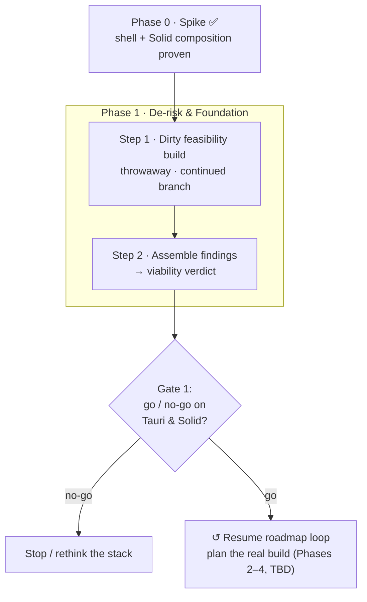

# Tauri + Solid — Spike → Release Roadmap

Project-management plan for migrating the desktop stack (Electron → Tauri, React →
Solid) from the proven spike all the way to release — **deliberately not** rushing
to a compiling app. Companion to [`tauri-solid-rebuild.md`](./tauri-solid-rebuild.md)
(the *why/what* + dependency mapping); this doc is the *how/when* + decision gates.

## How this doc is built
Built iteratively: propose the next logical step → pressure-test it → record it here
with a Mermaid update. Each step uses the same shape so the roadmap stays scannable:

> **Step** · Goal · Deliverable(s) · Risks/unknowns · **Exit criteria (the gate)**

The **exit criteria** are the point — "how do we *know* this is done and we're allowed
to move on" — so the plan resists scope drift. Phases are buckets; steps fill them as
the loop progresses. `TBD` = not yet defined.

## Visual roadmap

---

## Phase 0 — Spike ✅ (done)
Shell + Solid composition proven. `apps/tauri` (Rust shell + `invoke` ping) and
`packages/solid-client` (placeholder UI) are merged to `staging` and run via
`npm run tauri:dev`. No `@shared` wiring yet — purely "does the shell host Solid."

---

## Phase 1 — De-risk & Foundation

### Step 1 — Dirty feasibility build (throwaway)
**Status:** planned · not started

**Branch / disposability:** lives **only** on `feat/tauri-solid-continued`, **never
merges**, deleted on exit. The code is garbage by design — only the *findings*
survive. This framing is intentional: pre-deciding it's disposable removes the
sunk-cost pressure to "save what we wrote," which is what caused prior refactor pain.

**Goal:** answer the load-bearing "will it even work" questions *before* committing
to any architecture. Hack freely — crappy auth, minimal UI, direct backend calls.

**Probes (these questions ARE the gate):**

| # | Probe | What it proves | Result | Notes |
|---|---|---|---|---|
| 1 | **Injection** | Shell can inject *real* capabilities into Solid (beyond `ping`) | — | |
| 2 | **`@shared` from Solid** | Solid can drive the framework-agnostic shared logic (stores/nexus), incl. a strategy for the ~7 React-bound files — *the load-bearing assumption of the whole migration* | — | |
| 3 | **Supabase in WKWebView** | Hacked login, session persistence, and **Realtime websockets** alive in the native webview (not Chromium) | ✅* | `signInWithPassword` ✅ + `functions.invoke("voice-token")` ✅ in WKWebView (via the voice run). *Supabase **Realtime channels** not yet directly exercised — but auth + functions + LiveKit `wss://` all work, so transport viability is strongly indicated. |
| 4 | **Essential Solid libs** | Kobalte (dialog/menu), a virtualized list (chat), markdown, and the editor core render + function | — | |
| 5 | **OS bridge** | One real Tauri command beyond `ping` round-trips (secure storage / notification / fs) | 🔄 | Native mic permission (Info.plist + audio-input entitlement) ✅ + `ping` invoke ✅ (spike). A richer native command (fs / notification / secure-storage) still to test. |
| 6 | **Voice** | Minimal LiveKit: join a room + hear audio in WKWebView. *Highest-risk item — a ❌ here halts the Tauri bet* | ✅ | **Full chain cleared.** Mic capture → Supabase sign-in → `voice-token` → LiveKit connect (WebRTC in WKWebView) → publish + subscribe → **two-way audio confirmed cross-device** (Tauri ↔ desktop). |

Result legend: ✅ works · ⚠️ works with caveats · ❌ blocker.

**Deliverable:** a findings writeup (the table above, filled) + an explicit **go/no-go
recommendation on (a) the Tauri shell and (b) the Solid UI**.

**Risks / unknowns:**
- WKWebView ≠ Chromium — WebRTC (voice), websockets (realtime), and media permissions are where native webviews bite.
- The Solid ↔ `@shared` reactivity bridge (wrapping vanilla stores into signals).
- Solid library maturity (Kobalte / virtua / cmdk-solid).

**Exit criteria (gate):** all 6 probes answered (✅/⚠️/❌ with notes). Feeds Step 2.
Once findings are captured → **nuke the dirty build.**

**Execution order (refined):** **hardline the calls** — no `@shared` reactivity in the
voice track (that stays a separate probe), for diagnostic purity. Voice is a dependency
chain; run cheapest-gate-first:
1. WKWebView `getUserMedia({audio})` + native mic config (Info.plist usage string +
   audio-input entitlement). ← **gate**; if the webview can't capture mic, voice is dead.
2. Authed Supabase client → `voice-token` invoke (`{ communityId, channelId }`) for a real room.
3. `livekit-client` connect → publish mic → subscribe audio → join the same channel from desktop.

Probe 2 (`@shared` from Solid) is an independent track. Real community/channel ids + a
test account are hardcoded in the junk build for the cross-device test.

### Step 2 — Assemble findings & viability verdict (Gate 1)
**Status:** planned

**Goal:** turn the 6 probe results into a reliable go/no-go prediction for the *full*
build. This is the formal **Gate 1** — the decision on whether the stack is worth
committing to. We do this *immediately* after Step 1; no continuation is planned
before it, because planning a build that might be DOA is wasted effort.

**Deliverable:** the filled findings table + a written verdict:
- **GO** — stack is viable → re-enter the roadmap loop and plan the real build.
- **NO-GO** — a probe is a hard blocker → stop, rethink the stack.
- **CONDITIONAL** — viable, but with named blockers to resolve before committing.

**Exit criteria (gate):** a recorded decision — GO / NO-GO / CONDITIONAL.

---

## Phases 2–4 — intentionally unplanned
Left `TBD` **on purpose.** No point planning the parity build, cutover, or release
until Gate 1 says the stack isn't DOA — planning past an unvalidated gate is the exact
wasted-effort trap this roadmap exists to avoid. We re-enter the
propose → discuss → record loop **after Step 2 returns GO.**
